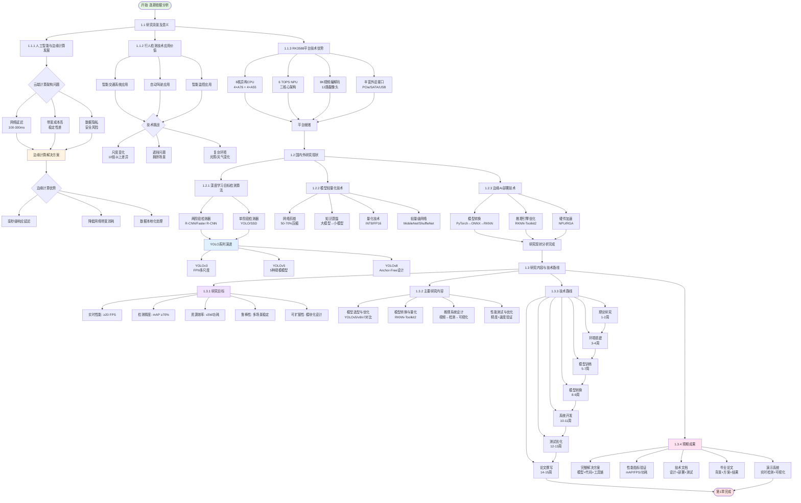

# 第1章 选题依据 - 研究背景分析流程图

## 流程图说明

### 主要流程

1. **研究背景及意义 (1.1)**
   - 人工智能与边缘计算发展趋势分析
   - 行人检测技术应用价值探讨
   - RK3588平台技术优势总结

2. **国内外研究现状 (1.2)**
   - 深度学习目标检测算法演进（R-CNN → YOLO → YOLOv8）
   - 模型轻量化技术综述（剪枝、蒸馏、量化、轻量级网络）
   - 边缘AI部署技术现状（模型转换、推理优化、硬件加速）

3. **研究内容与技术路线 (1.3)**
   - 5大研究目标（实时性、精度、效率、鲁棒性、可扩展性）
   - 4大研究内容（模型优化、转换部署、系统设计、性能测试）
   - 7阶段技术路线（15周完整计划）
   - 5项预期成果（方案、指标、文档、论文、演示）

### 关键决策点

- **云端 vs 边缘计算**: 延迟、带宽、隐私问题驱动边缘计算选择
- **两阶段 vs 单阶段检测器**: 实时性需求选择YOLO单阶段检测器
- **模型选型**: YOLOv5/v8在精度和速度间取得平衡

### 技术挑战

- 尺度变化（10倍以上）
- 遮挡问题（拥挤场景）
- 复杂环境（光照/天气变化）
- 实时性要求（≥20 FPS）
- 资源约束（≤5W功耗）
