# 第2章 设计方案 - 总体技术方案流程图

```mermaid
flowchart TD
    Start([开始: 设计方案]) --> Overview[2.1 总体技术方案]

    Overview --> Offline[离线阶段: 模型训练与转换<br/>PC端执行]
    Overview --> Online[在线阶段: 边缘端实时推理<br/>RK3588端执行]

    %% 离线阶段流程
    Offline --> Step1[步骤1: 数据集准备]
    Step1 --> Dataset{数据集选择}
    Dataset --> COCO[COCO数据集<br/>20万+图像]
    Dataset --> CityPersons[CityPersons数据集<br/>5000张城市场景]

    COCO --> Preprocess1[数据预处理<br/>统计尺度分布]
    CityPersons --> Preprocess1

    Preprocess1 --> Step2[步骤2: 模型训练]
    Step2 --> BaseModel{选择基础架构}
    BaseModel --> YOLOv5s[YOLOv5s<br/>参数量小]
    BaseModel --> YOLOv8n[YOLOv8n<br/>速度快]

    YOLOv5s --> Transfer[迁移学习<br/>COCO预训练权重]
    YOLOv8n --> Transfer

    Transfer --> Augmentation[数据增强<br/>提高泛化能力]

    Augmentation --> Step3[步骤3: 模型优化]
    Step3 --> Pruning[网络剪枝<br/>压缩50-60%参数]
    Step3 --> KD[知识蒸馏<br/>可选]

    Pruning --> Step4[步骤4: 模型导出]
    KD --> Step4

    Step4 --> Export_ONNX[导出ONNX格式<br/>开放模型表示]
    Export_ONNX --> Simplify[onnx-simplifier<br/>图优化]

    Simplify --> Step5[步骤5: RKNN模型转换]
    Step5 --> RKNN_Config[配置RKNN-Toolkit2<br/>目标平台: rk3588]
    RKNN_Config --> Load_ONNX[加载ONNX模型]
    Load_ONNX --> Quantize[执行INT8量化<br/>500-1000张校准图像]

    Quantize --> Step6[步骤6: 模型验证]
    Step6 --> PC_Sim[PC端模拟器验证<br/>RKNN-Toolkit2]
    PC_Sim --> Accuracy_Check{精度检查}
    Accuracy_Check -->|损失>2%| Adjust[调整量化策略]
    Adjust --> Quantize
    Accuracy_Check -->|损失≤2%| Transfer_Model[传输RKNN模型<br/>到RK3588开发板]

    Transfer_Model --> Online_Ready[在线阶段准备就绪]

    %% 在线阶段流程
    Online --> Module1[模块1: 视频采集]
    Module1 --> Capture{摄像头类型}
    Capture --> USB_Camera[USB摄像头]
    Capture --> MIPI_Camera[MIPI-CSI摄像头]

    USB_Camera --> Independent_Thread[独立线程运行<br/>提高吞吐量]
    MIPI_Camera --> Independent_Thread

    Independent_Thread --> Module2[模块2: 图像预处理]
    Module2 --> Color_Convert[颜色空间转换<br/>BGR→RGB]
    Color_Convert --> Resize[图像缩放<br/>640×640或416×416]
    Resize --> Normalize[归一化<br/>uint8或float32]
    Normalize --> Format[数据排列<br/>NHWC格式]

    Format --> RGA_Accel{使用RGA硬件加速?}
    RGA_Accel -->|是| RGA[RGA硬件单元加速]
    RGA_Accel -->|否| OpenCV[OpenCV库处理]

    RGA --> Module3[模块3: NPU推理]
    OpenCV --> Module3

    Module3 --> Load_RKNN[加载RKNN模型<br/>RKNN Runtime库]
    Load_RKNN --> Inference_Mode{推理模式}
    Inference_Mode --> Async[异步推理<br/>提高NPU利用率]
    Inference_Mode --> Sync[同步推理<br/>简单实现]

    Async --> Forward[NPU前向推理<br/>目标检测]
    Sync --> Forward

    Forward --> Module4[模块4: 后处理]
    Module4 --> Decode[坐标解码<br/>YOLO输出解析]
    Decode --> Conf_Filter[置信度过滤<br/>threshold≥0.5]
    Conf_Filter --> NMS[非极大值抑制<br/>去除重复框]
    NMS --> Coord_Map[坐标映射<br/>映射回原图尺寸]

    Coord_Map --> SIMD_Accel{使用SIMD加速?}
    SIMD_Accel -->|是| SIMD[CPU SIMD指令集<br/>C++实现]
    SIMD_Accel -->|否| Standard[标准实现]

    SIMD --> Module5[模块5: 结果可视化]
    Standard --> Module5

    Module5 --> Draw_Box[绘制边界框<br/>彩色矩形]
    Draw_Box --> Draw_Label[标注置信度<br/>文字显示]
    Draw_Label --> Output{输出方式}
    Output --> HDMI[HDMI显示器<br/>实时显示]
    Output --> Save[保存文件<br/>图像/视频]
    Output --> Network[网络传输<br/>UDP/TCP]

    HDMI --> Pipeline_End[在线推理流程完成]
    Save --> Pipeline_End
    Network --> Pipeline_End

    Online_Ready --> Module1
    Pipeline_End --> KeyTech[2.2 关键技术方法]

    %% 关键技术方法
    KeyTech --> Tech1[2.2.1 YOLO算法原理与改进]
    Tech1 --> YOLO_Structure[YOLO网络结构]
    YOLO_Structure --> Backbone[Backbone: CSPDarknet53<br/>特征提取]
    YOLO_Structure --> Neck[Neck: PANet<br/>多尺度融合]
    YOLO_Structure --> Head[Head: 检测头<br/>预测框+类别]

    Backbone --> YOLOv8_Improve[YOLOv8改进]
    Neck --> YOLOv8_Improve
    Head --> YOLOv8_Improve

    YOLOv8_Improve --> Anchor_Free[Anchor-Free设计<br/>无预定义框]
    YOLOv8_Improve --> Decoupled_Head[Decoupled Head<br/>分类定位解耦]
    YOLOv8_Improve --> TAA[Task-Aligned Assigner<br/>动态样本分配]

    Anchor_Free --> Pedestrian_Opt[行人检测优化]
    Decoupled_Head --> Pedestrian_Opt
    TAA --> Pedestrian_Opt

    Pedestrian_Opt --> Anchor_Adjust[调整Anchor尺寸<br/>适配行人尺度]
    Pedestrian_Opt --> Small_Obj[增强小目标检测<br/>多尺度特征]
    Pedestrian_Opt --> Attention[添加注意力机制<br/>提升关键特征]

    KeyTech --> Tech2[2.2.2 模型量化技术]
    Tech2 --> Quant_Principle[量化原理<br/>浮点→定点]
    Quant_Principle --> Weight_Quant[权重量化<br/>模型参数]
    Quant_Principle --> Act_Quant[激活量化<br/>中间结果]

    Weight_Quant --> INT8_Quant[完全INT8量化<br/>内存↓75%, 速度↑2-4x]
    Act_Quant --> INT8_Quant

    INT8_Quant --> Quant_Type{量化类型}
    Quant_Type --> Symmetric[对称量化<br/>数据零对称分布]
    Quant_Type --> Asymmetric[非对称量化<br/>允许分布偏移]

    Symmetric --> Mixed_Precision[混合精度量化<br/>敏感层高精度]
    Asymmetric --> Mixed_Precision

    Mixed_Precision --> Calib_Dataset[校准数据集<br/>统计数据分布]

    KeyTech --> Tech3[2.2.3 推理性能优化策略]
    Tech3 --> Zero_Copy[零拷贝技术<br/>DMA+共享内存]
    Tech3 --> Pipeline[流水线并行<br/>多线程执行]
    Tech3 --> Preload[模型预加载<br/>减少首次延迟]

    Zero_Copy --> System_Opt[系统级优化完成]
    Pipeline --> System_Opt
    Preload --> System_Opt

    System_Opt --> Schedule[2.3 进度安排]

    %% 进度安排
    Schedule --> Week1_2[第1-2周: 文献调研<br/>理论学习+开题报告]
    Week1_2 --> Week3_4[第3-4周: 环境搭建<br/>开发环境+数据准备]
    Week3_4 --> Week5_7[第5-7周: 模型训练<br/>训练+剪枝+蒸馏]
    Week5_7 --> Week8_9[第8-9周: 模型转换<br/>RKNN转换+量化]
    Week8_9 --> Week10_11[第10-11周: 系统开发<br/>推理应用程序]
    Week10_11 --> Week12_13[第12-13周: 系统测试<br/>性能测试+优化]
    Week12_13 --> Week14[第14周: 论文撰写<br/>整理实验数据]
    Week14 --> Week15[第15周: 答辩准备<br/>PPT+演示视频]

    Week15 --> Feasibility[2.4 可行性分析]

    %% 可行性分析
    Feasibility --> Cost[成本核算]
    Cost --> HW_Cost[硬件成本: 450-500元<br/>开发板+摄像头+配件]
    Cost --> SW_Cost[软件成本: 500-2000元<br/>云GPU租用]
    Cost --> Time_Cost[时间成本: 15周<br/>约600小时]

    Feasibility --> Tech_Feasibility[技术可行性]
    Tech_Feasibility --> Platform_OK[硬件平台: 6 TOPS NPU<br/>满足实时需求]
    Tech_Feasibility --> Toolchain_OK[软件工具链: 成熟完善<br/>RKNN-Toolkit2]
    Tech_Feasibility --> Accuracy_OK[算法精度: mAP 70-80%<br/>文献验证可行]

    Feasibility --> Risk[风险评估]
    Risk --> Risk1[风险1: 量化精度下降<br/>应对: 混合精度+QAT]
    Risk --> Risk2[风险2: 实时性不达标<br/>应对: 压缩模型+优化代码]
    Risk --> Risk3[风险3: 硬件故障<br/>应对: PC模拟器开发]

    Feasibility --> Impact[2.5 社会/环保/法律影响]

    Impact --> Social[社会影响]
    Social --> ITS_App[智能交通: 事故率↓15-20%]
    Social --> Auto_App[自动驾驶: 提升安全性]
    Social --> Security_App[公共安全: 预防踩踏]

    Impact --> Environment[环保考虑]
    Environment --> Energy_Save[降低数据中心能耗<br/>边缘计算架构]
    Environment --> Efficient_Chip[高能效比芯片<br/>8nm工艺, NPU加速]

    Impact --> Legal[法律与伦理]
    Legal --> Privacy_Law[遵守个人信息保护法<br/>最小必要原则]
    Legal --> Local_Process[数据本地化处理<br/>避免泄露风险]
    Legal --> Compliance[研究合规性<br/>使用公开数据集]

    ITS_App --> End([第2章完成])
    Energy_Save --> End
    Privacy_Law --> End

    style Start fill:#e1f5e1
    style End fill:#ffe1e1
    style Offline fill:#e1f0ff
    style Online fill:#fff4e1
    style KeyTech fill:#f0e1ff
    style Feasibility fill:#ffe1f0
    style Impact fill:#e1ffe1
```

## 流程图说明

### 2.1 总体技术方案

#### 离线阶段（PC端）
6个步骤的完整流程：
1. **数据集准备**: COCO + CityPersons数据集，预处理和统计分析
2. **模型训练**: YOLOv5s/v8n + 迁移学习 + 数据增强
3. **模型优化**: 网络剪枝（50-60%压缩）+ 知识蒸馏（可选）
4. **模型导出**: PyTorch → ONNX + onnx-simplifier图优化
5. **RKNN转换**: ONNX → RKNN INT8量化（500-1000张校准图像）
6. **模型验证**: PC模拟器验证，精度损失≤2%即通过

#### 在线阶段（RK3588端）
5个模块的流水线架构：
1. **视频采集**: USB/MIPI摄像头 + 独立线程
2. **图像预处理**: 颜色转换 → 缩放 → 归一化 → RGA硬件加速
3. **NPU推理**: 加载RKNN模型 → 异步/同步推理 → 前向计算
4. **后处理**: 解码 → 置信度过滤 → NMS → SIMD加速
5. **结果可视化**: 绘制边界框 → HDMI/文件/网络输出

### 2.2 关键技术方法

#### YOLO算法（2.2.1）
- **网络结构**: Backbone（CSPDarknet53） + Neck（PANet） + Head（检测头）
- **YOLOv8改进**: Anchor-Free + Decoupled Head + Task-Aligned Assigner
- **行人检测优化**: 调整Anchor + 小目标增强 + 注意力机制

#### 模型量化（2.2.2）
- **量化原理**: 浮点→定点，权重量化+激活量化
- **INT8量化**: 内存↓75%，速度↑2-4x
- **量化策略**: 对称/非对称量化 + 混合精度 + 校准数据集

#### 性能优化（2.2.3）
- **零拷贝**: DMA + 共享内存，减少数据拷贝
- **流水线并行**: 多线程独立执行各阶段
- **模型预加载**: 减少首次推理延迟

### 2.3 进度安排

15周完整计划：
- **Week 1-2**: 文献调研 + 理论学习
- **Week 3-4**: 环境搭建 + 数据准备
- **Week 5-7**: 模型训练 + 优化（剪枝+蒸馏）
- **Week 8-9**: 模型转换 + 量化
- **Week 10-11**: 系统开发（推理应用）
- **Week 12-13**: 测试 + 优化
- **Week 14**: 论文撰写
- **Week 15**: 答辩准备

### 2.4 可行性分析

#### 成本核算
- **硬件**: 450-500元（开发板+摄像头+配件）
- **软件**: 500-2000元（云GPU租用）
- **时间**: 15周（约600小时）

#### 技术可行性
- **硬件平台**: 6 TOPS NPU满足实时需求（≥20 FPS）
- **软件工具链**: RKNN-Toolkit2成熟完善
- **算法精度**: mAP 70-80%（文献验证可行）

#### 风险应对
- **风险1**: 量化精度下降 → 混合精度+量化感知训练
- **风险2**: 实时性不达标 → 压缩模型+优化代码+降低分辨率
- **风险3**: 硬件故障 → PC模拟器开发

### 2.5 影响分析

#### 社会影响
- 智能交通: 事故率↓15-20%，效率↑30%
- 自动驾驶: 提升行人检测安全性
- 公共安全: 人流统计，预防踩踏

#### 环保考虑
- 边缘计算架构减少数据中心能耗
- 8nm工艺+NPU加速，能效比提升10倍

#### 法律伦理
- 遵守个人信息保护法（最小必要原则）
- 数据本地化处理（避免隐私泄露）
- 使用公开数据集（研究合规）
