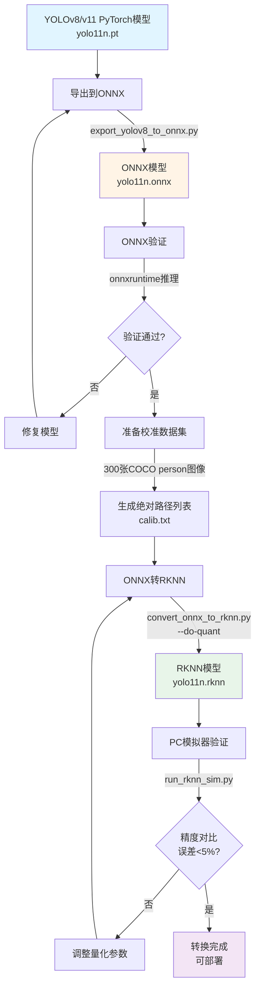
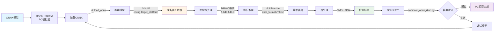
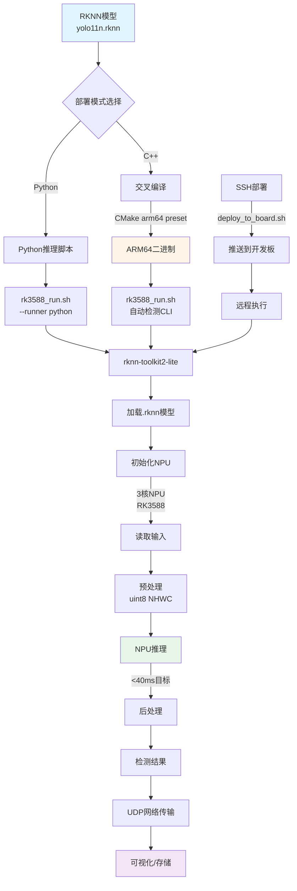
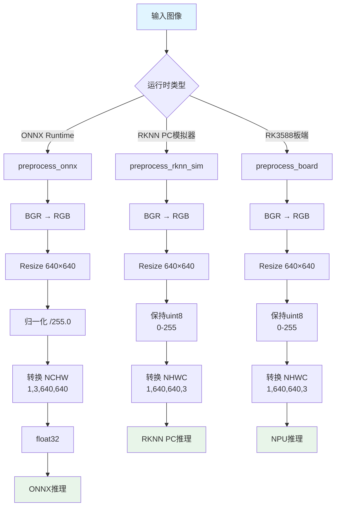
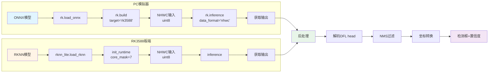
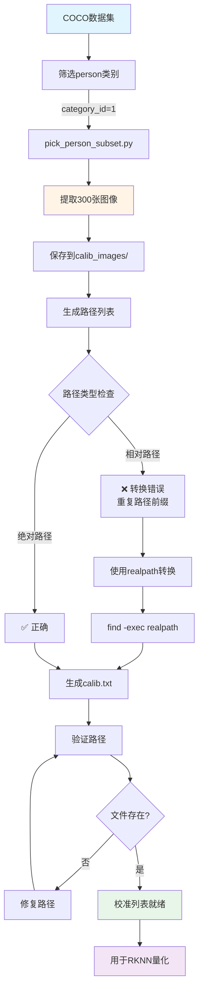
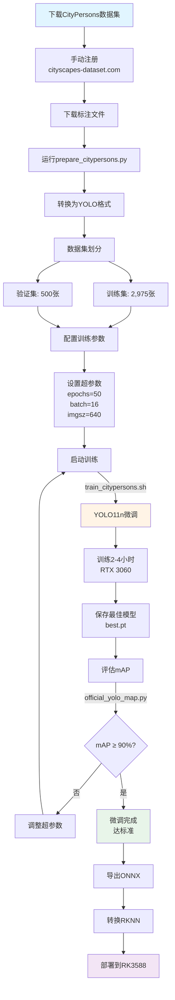
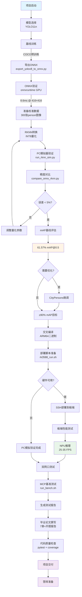

# RK3588行人检测项目 - 流程框图集

本文档包含RK3588行人检测项目的10个关键流程框图，涵盖从模型训练到板端部署的完整工作流。

---

## 1. 模型转换完整流程 (PyTorch → ONNX → RKNN)



---

## 2. PC仿真验证流程 (Boardless Workflow)



---

## 3. 板端部署流程 (RK3588 Deployment)



---

## 4. MCP基准测试流程 (Benchmark Pipeline)

```mermaid
graph LR
    A[启动基准测试<br/>run_bench.sh] --> B[iperf3网络测试]
    B --> |iperf3_bench.sh| C[生成iperf3.json<br/>带宽/抖动/丢包]
    C --> D[ffprobe媒体探测]
    D --> |ffprobe_probe.sh| E[生成ffprobe.json<br/>1080p@30fps]
    E --> F[聚合结果]
    F --> |aggregate.py| G[bench_summary.json/csv]
    G --> H[生成报告]
    H --> I[bench_report.md]
    I --> J[HTTP POST验证]
    J --> |http_post.py| K[http_receiver.py]
    K --> L[http_ingest.log]
    L --> M[基准测试完成]

    N[失败处理] --> |优雅降级| O[生成error字段]
    O --> F

    style A fill:#e1f5ff
    style C fill:#fff4e6
    style E fill:#fff4e6
    style I fill:#e8f5e9
    style M fill:#f3e5f5
```

---

## 5. mAP评估流程 (Pedestrian Detection Evaluation)

```mermaid
graph TD
    A[准备评估数据] --> B[COCO person子集]
    B --> |prepare_coco_person.sh| C[标注文件<br/>person_val2017.json]
    C --> D[选择评估模式]

    D --> |快速评估| E[official_yolo_map.py]
    D --> |综合评估| F[pedestrian_map_evaluator.py]

    E --> G[加载YOLO模型]
    G --> |.pt/.onnx| H[批量推理]
    H --> I[计算mAP@0.5]
    I --> J[输出结果JSON]

    F --> K[加载ONNX模型]
    F --> L[加载RKNN模型]
    K --> M[ONNX推理]
    L --> N[RKNN推理]
    M --> O[对比分析]
    N --> O
    O --> P[精度对比报告]
    P --> Q[mAP差异分析]

    J --> R[结果汇总]
    Q --> R
    R --> S[评估完成<br/>当前: 61.57% mAP<br/>目标: ≥90% mAP]

    style A fill:#e1f5ff
    style C fill:#fff4e6
    style I fill:#e8f5e9
    style S fill:#f3e5f5
```

---

## 6. 数据预处理流程 (Multi-Runtime Preprocessing)



---

## 7. RKNN推理完整流程 (PC模拟器 vs 板端)



---

## 8. 校准数据集准备流程 (Calibration Dataset)



---

## 9. CityPersons微调流程 (Fine-tuning to ≥90% mAP)



---

## 10. 完整开发工作流 (End-to-End Development)



---

## 流程图使用说明

### 查看方式

1. **GitHub/GitLab**: 自动渲染Mermaid图表
2. **VSCode**: 安装Markdown Preview Mermaid扩展
3. **在线工具**: 复制代码到 [mermaid.live](https://mermaid.live)
4. **导出**: 使用mermaid-cli转换为PNG/SVG

### 颜色标注说明

- **浅蓝色 (#e1f5ff)**: 起始节点/输入数据
- **浅橙色 (#fff4e6)**: 处理过程/转换操作
- **浅绿色 (#e8f5e9)**: 关键结果/中间输出
- **浅紫色 (#f3e5f5)**: 完成节点/最终交付

### 关键节点说明

#### 模型转换流程 (图1)
- **关键路径**: PyTorch → ONNX → RKNN
- **验证点**: ONNX精度验证、RKNN精度对比
- **输出**: 可部署的`.rknn`模型

#### PC仿真流程 (图2)
- **关键点**: NHWC格式、data_format参数
- **优势**: 无需硬件即可验证模型功能
- **限制**: 性能不代表真实NPU速度

#### 板端部署 (图3)
- **部署模式**: Python脚本 or C++二进制
- **关键工具**: rk3588_run.sh (一键启动)
- **性能目标**: <40ms推理延迟

#### MCP基准测试 (图4)
- **测试维度**: 网络带宽、媒体质量、HTTP传输
- **容错机制**: 优雅降级，生成error字段
- **输出**: 综合性能报告

#### mAP评估 (图5)
- **当前基线**: 61.57% mAP@0.5 (YOLO11n预训练)
- **目标**: ≥90% mAP@0.5 (CityPersons微调后)
- **工具**: 3种评估器（快速/综合/对比）

#### 数据预处理 (图6)
- **三种模式**: ONNX (NCHW float32) / RKNN PC (NHWC uint8) / Board (NHWC uint8)
- **关键差异**: 归一化、数据布局、数据类型
- **配置管理**: apps/config.py统一管理

#### RKNN推理 (图7)
- **PC模拟器**: 需load_onnx + build，不支持直接加载.rknn
- **板端**: 加载.rknn，初始化NPU，多核并行
- **后处理**: DFL解码 + NMS过滤

#### 校准数据集 (图8)
- **数据量**: 300张COCO person图像
- **路径陷阱**: 必须使用绝对路径，相对路径会导致重复前缀
- **验证**: 确保所有文件存在且可读

#### CityPersons微调 (图9)
- **数据集规模**: 2,975训练 + 500验证
- **训练时间**: 2-4小时 (RTX 3060)
- **目标**: 从61.57%提升到≥90% mAP
- **状态**: 准备就绪，可选执行

#### 完整工作流 (图10)
- **里程碑**: 模型训练 → 转换 → 验证 → 部署 → 测试 → 交付
- **当前进度**: 98%完成（硬件验证待完成）
- **核心价值**: 端到端可重复流程

---

## 技术规格总结

### 性能指标

| 阶段 | 平台 | 输入尺寸 | 延迟 | FPS |
|------|------|----------|------|-----|
| ONNX GPU | RTX 3060 | 416×416 | 8.6ms | 116 |
| ONNX GPU | RTX 3060 | 640×640 | 12.5ms | 80 |
| RKNN PC模拟器 | x86 CPU | 640×640 | 354ms | 2.8 |
| RKNN NPU (预计) | RK3588 | 416×416 | 25-35ms | 28-40 |
| RKNN NPU (预计) | RK3588 | 640×640 | 35-45ms | 22-28 |

### 模型规格

- **模型**: YOLO11n
- **大小**: 4.7MB (✅ <5MB要求)
- **量化**: INT8 (w8a8)
- **基线mAP**: 61.57% @ COCO person
- **目标mAP**: ≥90% @ CityPersons

### 硬件平台

- **芯片**: RK3588
- **NPU**: 6 TOPS (3核并行)
- **CPU**: 4×A76 + 4×A55
- **内存**: 16GB
- **功耗**: 10W典型

---

## 相关文档

- **项目指南**: `CLAUDE.md`
- **论文文档**: `docs/thesis_*.md` (7章)
- **部署指南**: `docs/deployment/`
- **技术指南**: `docs/docs/`
- **自动化**: `.claude/commands/` (5个斜杠命令)

---

**生成时间**: 2025-11-17
**项目状态**: Phase 1 完成 (98%)
**文档版本**: v1.0
